<div align="center">

# Guild Hall

Track quests, hunters, and rewards on a Monster Hunter-inspired guild board.

[![Live][badge-site]][url-site]
[![HTML5][badge-html]][url-html]
[![CSS3][badge-css]][url-css]
[![JavaScript][badge-js]][url-js]
[![Claude Code][badge-claude]][url-claude]
[![License][badge-license]](LICENSE)

[badge-site]:    https://img.shields.io/badge/live_site-0063e5?style=for-the-badge&logo=googlechrome&logoColor=white
[badge-html]:    https://img.shields.io/badge/HTML5-E34F26?style=for-the-badge&logo=html5&logoColor=white
[badge-css]:     https://img.shields.io/badge/CSS3-1572B6?style=for-the-badge&logo=css3&logoColor=white
[badge-js]:      https://img.shields.io/badge/JavaScript-F7DF1E?style=for-the-badge&logo=javascript&logoColor=black
[badge-claude]:  https://img.shields.io/badge/Claude_Code-CC785C?style=for-the-badge&logo=anthropic&logoColor=white
[badge-license]: https://img.shields.io/badge/license-MIT-404040?style=for-the-badge

[url-site]:   https://guildhall.neorgon.com/
[url-html]:   #
[url-css]:    #
[url-js]:     #
[url-claude]: https://claude.ai/code

</div>

---

## Overview

A gamified quest board inspired by Monster Hunter World and Rise. Post feature requests, bugs, and improvements as quests with rank tiers (Low, High, Master) and star ratings. Hunters accept quests, complete them, and earn badges on their guild card.

**Live:** guildhall.neorgon.com

---

## Features

- **Quest board** -- browse, filter, and accept quests by rank (Low/High/Master), star rating, status, and category
- **Rank system** -- Low Rank (1-3 stars), High Rank (4-6 stars), Master Rank (7-9 stars) with distinct colors
- **Quest types** -- Hunt (feature), Slay (bugfix), Capture (improvement), Investigation (research)
- **Multiplayer hunts** -- multiple hunters can accept the same quest
- **Hunter cards** -- profile with earned badges, title progression, and quest history
- **Badge system** -- 12 earnable badges across Low, High, Master, and Special tiers
- **Quest lifecycle** -- Posted, Active, Completed with "Carve Rewards" confirmation
- **SOS Flare** -- alert button for requesting help on difficult quests
- **Easter eggs** -- Poogie with outfit cycling, Handler quotes, quest complete celebration overlay, MH-themed quest names

---

## Running locally

ES modules require an HTTP server (not `file://`):

```bash
python3 -m http.server
```

The app works standalone with localStorage. To enable Convex backend:

```bash
npm install
npx convex dev
```

---

## Architecture



```
guild-hall-site/
├── index.html           # HTML shell with quest board, modals, Poogie
├── css/
│   └── style.css        # MH-themed styles, rank colors, quest cards
├── js/
│   ├── app.js           # Entry point
│   ├── state.js         # State management, localStorage, auth helpers
│   ├── data.js          # Ranks, badges, categories, handler quotes, sample quests
│   ├── render.js        # Quest grid, detail modal, hunter card rendering
│   ├── events.js        # Filters, auth, quest actions, Poogie, SOS
│   └── utils.js         # escHtml, showToast, starsHtml, timeAgo
├── convex/
│   ├── schema.ts        # Tables: users, quests, hunters
│   ├── auth.ts          # Login and register mutations
│   ├── quests.ts        # Quest CRUD, accept, complete mutations
│   └── tsconfig.json    # Convex TypeScript config
├── package.json         # convex dependency
├── robots.txt           # Search engine access rules
├── sitemap.xml          # Search engine sitemap
└── CNAME                # guildhall.neorgon.com
```

---

<div align="center">
<sub>Part of <a href="https://neorgon.com/">Neorgon</a></sub>
</div>
